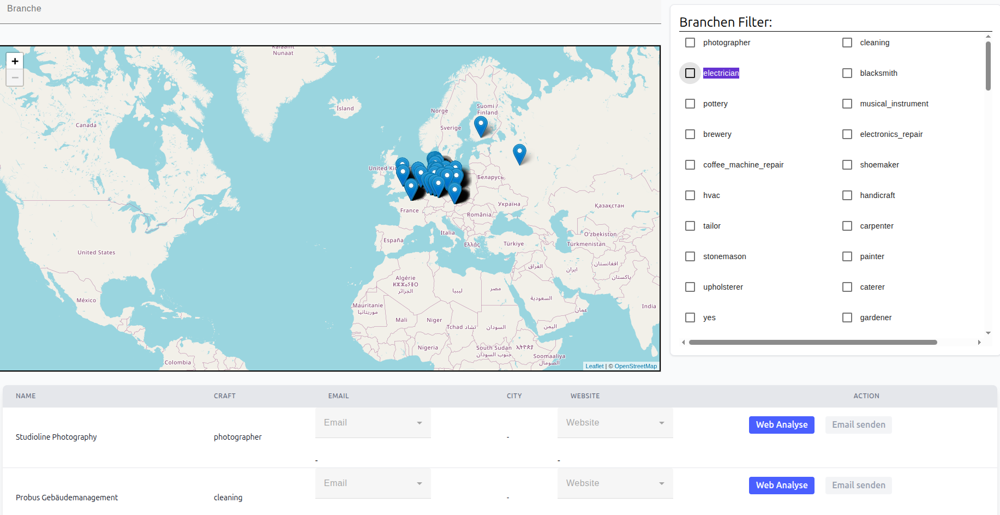

# About


This is a weekend project to find small and medium-sized businesses that have a website but whose site no longer meets today’s standards.
It was implemented with Node and Angular.
The backend crawls the websites and looks for email addresses to contact me.
it looks for companies in a radius and finds emails/websites.
If none are found we enrich the data trhough queries.
Choices will be remembered an an email can be sent to customer if they wish to get in touch to improve their websites.
I also want to make some more analysis on this, as i manually have to look at websites right now. 

This Project uses following services(names are subject to change):

- Frontend: an Angular application deployed with nginx.
- Email: A FastAPI endpoint to sent mails to pot. customers
- Crawler: a tool to crawl websites of customers.
- ORM: object relational mapper, implemented in Python using sqlAlchemy
- Postgres: as a db
- Keycloak: for Auth (or rather in progress)

For deployments I use a combination of Helm and skaffold to make deploying and testing easier.

## Setup

Note I run this for tests locally using Kind. I am not sure how it is going to work for other setups.

Inside the helm value examples are variables 

``` yaml
      GOOGLE_CSE_ID: SOMEID
      GOOGLE_API_KEY: SOMEKEY
```

Which are not set. you must create them yourself, since the current workflow is find companies -> search for their website (via google) -> crawl their pages.


you have to run the following command to have the values for the dev environment for helm:
`cp /helm/webscanner/values-dev.yaml.example /helm/webscanner/values-dev.yaml`
then, if you run:
`skaffold dev`
the project should set itself up.

to Debug Mails, I use Maildev. 
I created an ingress for maildev @maildev.local that you have to forward to the node ip if you want to use it (other ways are obviousl fine as well.
